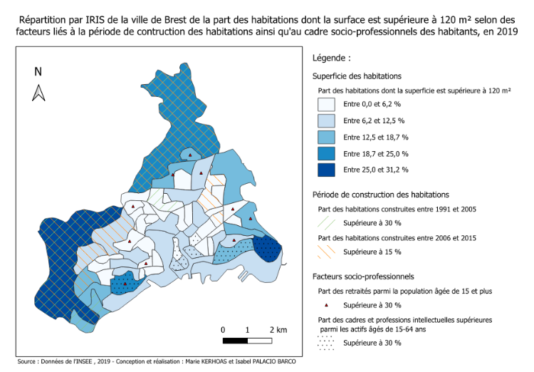

## Contexte du projet

Ce travail mobilise les outils de l’économétrie spatiale pour étudier la répartition des logements de grande superficie(\>120 m²) dans les 64 IRIS de la ville de Brest.\
L’analyse explore le rôle des facteurs socio-économiques, de la structure du bâti et des effets de voisinage dans la distribution des grands logements.\
L’objectif est d’évaluer comment les caractéristiques locales et la proximité géographique influencent la morphologie résidentielle urbaine.

------------------------------------------------------------------------

## Méthodologie

### Données et variables

La variable d’intérêt est la part des habitations \>120 m² par IRIS.

Quatre variables explicatives ont été mobilisées : - Part des logements construits entre 1991–2005 - Part des logements construits entre 2006–2015 - Part des cadres et professions intellectuelles supérieures - Part des retraités

Ces variables, exprimées en pourcentage, combinent des dimensions structurelles (ancienneté du bâti) et socio-économiques (revenu, âge, profil des habitants).

Les données spatiales proviennent du shapefile des IRIS de Brest, intégré dans GeoDa puis analysé sous R.

------------------------------------------------------------------------

### Analyse exploratoire

Une première cartographie a mis en évidence une forte hétérogénéité :

-   Les grands logements (\>120 m²) se concentrent dans quelques zones périphériques (Kerangall, Kervao, Mesdoun).\
-   Les logements récents (2006–2015) sont moins nombreux et davantage dispersés.
-   Les cadres se localisent majoritairement dans le sud de la ville, près du littoral.\
-   Les retraités sont plus uniformément répartis sur le territoire.

Les corrélations de Spearman révèlent une association positive entre la part de grands logements et la part de cadres (ρ = 0.58) ou de logements récents (ρ ≈ 0.45).

------------------------------------------------------------------------

## Analyse spatiale

### Autocorrélation spatiale

Trois matrices de pondération ont été testées :

1.  **Contiguïté de type Reine** (voisinage d’ordre 1)\
2.  **Plus proche voisin (1-NN)**\
3.  **Trois plus proches voisins (3-NN)**

L’indice de Moran global révèle une autocorrélation spatiale positive significative dans les trois cas (p \< 0.01), indiquant que les IRIS présentant une forte proportion de grands logements ont tendance à être regroupés géographiquement.

L’analyse locale (LISA) met en évidence des clusters *High–High* au nord (Kerallan, Le Restic) et au sud (Ports, Le Guelmeur), ainsi que des zones *Low–Low* autour de Bellevue et Kerbernard.

------------------------------------------------------------------------

## Modélisation économétrique spatiale

### Étape 1 – Modèle MCO

Une première régression linéaire a été estimée pour expliquer la part des habitations de plus de 120 m² à partir des variables explicatives sélectionnées.\
Les tests de Moran appliqués aux résidus ont mis en évidence une dépendance spatiale significative, indiquant que les hypothèses classiques d’indépendance ne sont pas vérifiées.\
Cette observation justifie le recours à des modèles spécifiquement conçus pour prendre en compte la structure spatiale des données.

------------------------------------------------------------------------

### Étape 2 – Choix du modèle

Des tests de Lagrange Multiplicateur (LM) et de leurs versions robustes (RLM) ont ensuite été réalisés pour déterminer la nature de la dépendance spatiale.\
Les résultats ont montré que la dépendance provenait principalement de la variable dépendante, orientant le choix vers un **modèle SAR (Spatial Autoregressive Model)** plutôt qu’un modèle d’erreurs spatiales (SEM).

------------------------------------------------------------------------

### Étape 3 – Estimation du modèle SAR

L’estimation du modèle SAR a confirmé la présence d’une autocorrélation spatiale significative.\
Toutes les variables explicatives conservent un effet positif sur la proportion de grands logements, ce qui traduit une cohérence entre le modèle et les dynamiques géographiques observées à Brest.\
Les résultats suggèrent ainsi que les caractéristiques socio-économiques et la structure du bâti des IRIS voisins exercent une influence conjointe sur la répartition des logements de grande superficie.

------------------------------------------------------------------------

## Discussion

Les résultats confirment que la structure du parc immobilier et la composition socio-professionnelle des quartiers influencent fortement la répartition des logements spacieux.\
L’existence d’un effet spatial montre que les IRIS voisins partagent des dynamiques communes, traduisant une segmentation résidentielle territorialisée.

Les modèles SAR se sont révélés plus performants que les MCO, tandis que les modèles SDM testés n’ont pas apporté d’amélioration significative.

Ces conclusions rejoignent les travaux de Le Gallo (2002) sur la pertinence de l’économétrie spatiale pour corriger les biais liés à la dépendance géographique.

------------------------------------------------------------------------

## Carte de synthèse

La carte finale, réalisée sous **QGIS**, illustre la distribution des grands logements à Brest et met en évidence les IRIS les plus concernés par les facteurs significatifs (période de construction, statut socio-économique).\
Les zones littorales et périphériques nord-ouest concentrent les surfaces les plus élevées.

------------------------------------------------------------------------

## Rapport complet

::: {style="text-align: center;"}
<iframe src="/pdf/econometrie_spatial.pdf" title="Projet d&#39;économétrie spatiale - Brest" width="85%" height="640" loading="lazy">

</iframe>
:::

## Conclusion

Cette étude montre l’apport des modèles spatiaux dans la compréhension des phénomènes urbains.\
La répartition des grandes habitations à Brest dépend à la fois des caractéristiques locales et des effets de voisinage, traduisant une organisation spatiale cohérente avec les logiques socio-économiques urbaines.\
Les méthodes de l’économétrie spatiale offrent ici une lecture quantitative fine des inégalités territoriales et des dynamiques urbaines.
