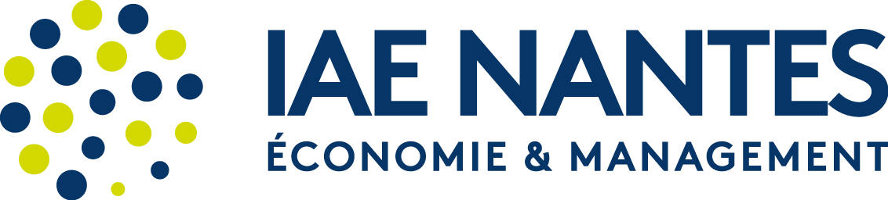

Ce blog a été créé pour vous présenter quelques-uns des projets sur lesquels j’ai eu l’occasion de travailler au cours de mon Master en Économétrie et Statistiques, parcours Économétrie Appliquée, à l'IAE de Nantes.

### **À propos de moi**

Mes études en Économétrie et Statistiques s’inscrivent dans ma démarche de reconversion professionnelle.

En effet, après plusieurs années d’expérience en vente, j’ai rejoint le groupe Iliad (Free). Cette expérience, combinant innovation et gestion d’équipe, m’a permis de développer **mes compétences commerciales et managériales.** Bien qu’étant épanouie dans mon rôle de manager, responsable d’une surface de vente et d’une équipe, **j’ai ressenti le besoin de me spécialiser davantage** et d’élargir mes horizons.

C’est ainsi que j’ai décidé de reprendre mes études en 2023, dans le monde de la donnée, qui m’intéressait particulièrement et dont j’étais convaincue de l’impact.  

Dès le mois d’avril, j’ai donc intégré la formation **DESU “Data Science pour les professionnels”** à l’Université d’Aix-Marseille, jusqu’en juin. Fortement motivée par l’envie d’approfondir davantage mes connaissances en statistique et informatique, j’ai ensuite choisi de poursuivre en **Master Économétrie et Statistiques.**

### **Le master**

[{width="230"}](https://iae.univ-nantes.fr/nos-formations/offre-de-formation/master-econometrie-appliquee)

Ce parcours à l'IAE est particulièrement attractif en raison de son approche professionnalisante, qui allie à la fois la théorique et la pratique. Il vise à développer des compétences solides dans des domaines tels que l’économie, l’économétrie, la statistique et l’informatique, des atouts indispensables pour évoluer dans le domaine du data science et de l’analyse quantitative. [📥 Télécharger "Présentation du Master économetrie et statistiques, économetrie appliquée M1 et M2" PDF](/pdf/ECAP.pdf)

Actuellement, je suis à la recherche d’un stage de fin d’études pour concrétiser ce parcours et mettre en pratique les compétences acquises durant ma formation.

Ce blog vous permettra de découvrir mes projets et travaux réalisés, au cours desquels j’ai souhaité explorer divers sujets qui me passionnent, tels que **l’agriculture, l’environnement, ainsi que différentes techniques d’analyse de données**. Pour certains de ces projets, j’ai voulu non seulement vous présenter les résultats de l’analyse, mais aussi partager le code utilisé. Mon objectif est de rendre la démarche plus transparente, tout en illustrant mon évolution.

Je vous souhaite une bonne visite, en espérant que vous y trouverez des éléments intéressants :) !
